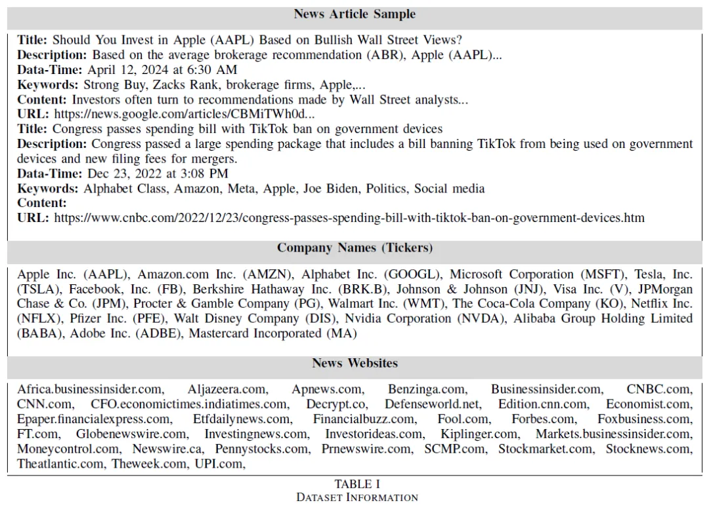
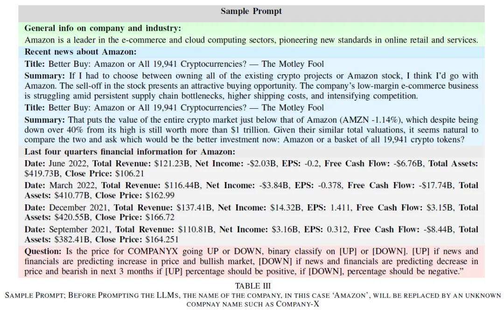
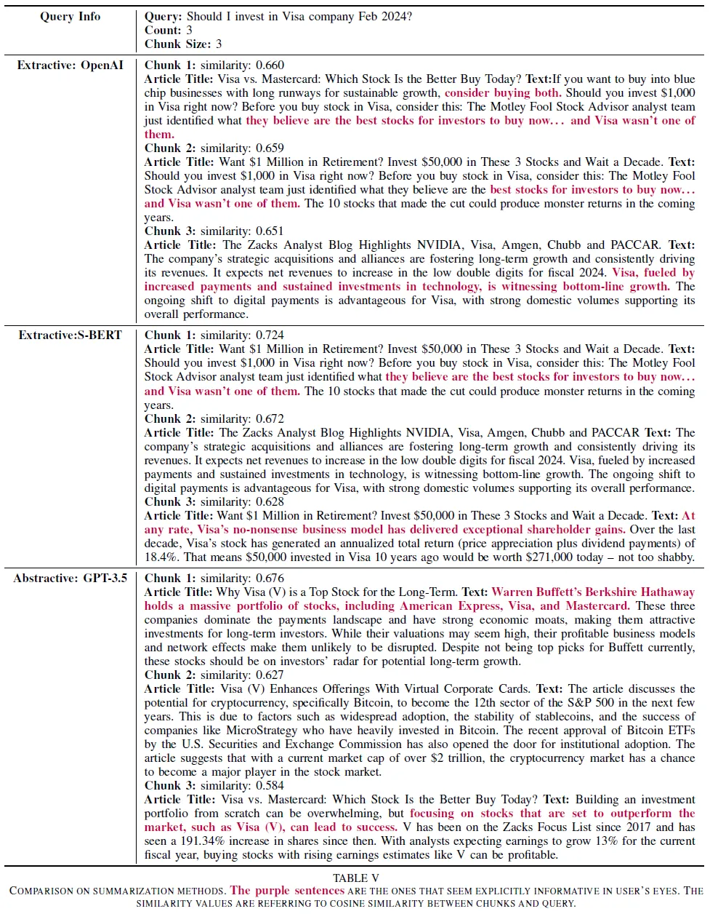
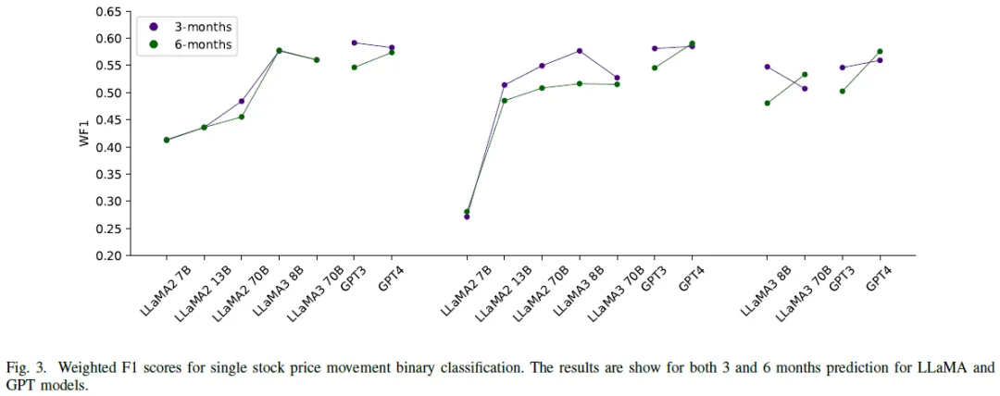

# 1. 资源

- Combining Financial Data and News Articles for Stock Price Movement Prediction Using Large Language Models
- 论文地址：https://arxiv.org/pdf/2411.01368

# 2. 摘要

预测金融市场和股票价格变动需分析公司表现、历史价格、行业事件及人类因素（如社交媒体和新闻报道）。本文结合财务数据（如财务报表）和文本新闻，使用预训练的大型语言模型（LLMs）进行市场运动预测。采用检索增强技术，将相关新闻片段与公司财务指标结合，使用零、二、四次示例设置提示LLMs。数据集包含20家高交易量公司的新闻文章、历史股价和财务报告数据。

使用GPT-3、GPT-4、LLaMA-2和LLaMA-3等模型进行分类，预测股票价格变动，3个月和6个月的加权F1分数分别为58.5%和59.1%，马修斯相关系数为0.175。

# 3. 简介

语言模型在金融行业的应用包括文本分类、语义分析和金融咨询等。价格运动预测是利用LLM预测未来股价涨跌的重要任务，涉及多种数据源。股票表现受多种因素影响，包括公司业绩、行业动态、社交媒体和新闻等。研究旨在设计基于LLM的模型，结合多种格式的数据进行股价运动分类，减少模型幻觉。研究采用零到四次示例的设置，避免大规模模型训练的资源消耗。

信息来源包括：

- 财务因素：使用10-K报告中的财务数据。
- 历史价格：分析历史价格变化以预测未来走势。
- 新闻：提取和总结社交媒体和新闻文章的信息。
- 行业和产品：考虑公司行业及其产品对价格的影响。

研究将收集20只高交易量股票的新闻和财务数据，模型和数据将在论文发布时提供。

# 4. 相关工作

传统方法使用机器学习算法（如支持向量机、决策树、前馈神经网络）进行分类，Weng等人利用Google新闻文章数量作为特征。后续研究转向使用序列神经网络（如LSTM、GRU）进行预测和运动分类，部分研究结合CNN网络。

最近研究探索使用大型语言模型预测价格波动，Wang等人提出LLMFactor模型，结合历史价格数据和新闻文章，提取关键短语和情感。Tong等人结合新闻和历史价格数据，利用多种“专家”分析股票特征，生成基于市场条件和专家意见的买卖理由。

# 5. 数据集

本文收集了20家公司从2021年至今的数据，包括10-K报告的财务信息和新闻文章。选择公司基于不同产业的交易量，重点关注交易量较大的公司。

新闻文章

使用爬虫收集与特定公司投资相关的新闻文章，依据标签/关键词和公司名称在标题中的出现。通过搜索查询在新闻网站上抓取特定日期和公司名称的链接。从生成的文章中提取信息，构建数据集。共提取5000篇新闻文章，涵盖20家公司，时间范围为2021年10月至2024年1月。

财务数据

财务数据来源于10-K季度报告，包括运营/收入表、现金流量表和资产负债表，均可在公司网站上获取。研究中还包括历史价格数据，但不作为时间序列数据处理，而是通过过去6个月和12个月的价格变化来捕捉价格动量。

# 6. 方法

检索方法

由于新闻文章的数量和每个公司在给定日期的信息量很大，我们需要找到一种方法来从大篇幅的文章中提取重要信息，我们实现了分层摘要方法。

首先，我们根据标题、副标题和发布日期等关键元数据过滤新闻文章，在文章中搜索公司名称和索引代码。随后，我们对所选文章进行了总结。为了比较，我们采用了抽象和抽取两种总结技术。对于抽取摘要，我们使用OpenAI和Sentence-BERT嵌入对三句长度的新闻文章块进行编码，并计算与用户查询的相似度。此外，对于抽象摘要，我们利用GPT-3.5模型生成与用户查询最相关的文章的摘要。

最后，我们决定继续使用OpenAI嵌入的三个句子大小的块进行提取摘要，以检索更相关的信息。

提示词生成和打标

模型性能受提示格式影响，信息结构和顺序对生成准确响应至关重要。通过实验不同的信息顺序和提示问题，找到最佳结果。提示包含公司产品、行业信息、相关新闻、财务数据及问题，平均长度约2500个tokens。示例问题：“我应该在2022年7月投资苹果公司吗？”相关数据来自2022年5-6月。目标是判断股票在未来三到六个月的涨跌，使用二进制标签（1表示涨，0表示跌）。分析语言模型在三个月和六个月的预测效果，寻找最佳预测时间段。提示生成过程包括公司基本信息，以避免数据泄露并提供行业背景。

模型

使用了多种预训练语言模型，包括Meta的LLaMA2（7B、13B、70B）、LLaMA3（8B、70B）和OpenAI的GPT-3.5、GPT-4。

LLaMA2模型在四样本学习中因输入提示过大而超出最大输入令牌限制，因此未纳入四样本分析。

# 7. 实验设置

使用零、二、四样本格式进行提示过程。零样本学习中，模型接收用户查询、公司信息、生成的文本和财务指标。准备了120个样本提示以测试模型预测准确性。二、四样本设置中，模型接收2个和4个示例提示及答案。二样本示例中每类各1个，四样本示例中每类各2个，以熟悉答案分布。

评估指标

使用准确率（正确预测/总预测）评估模型，但在不平衡数据集上效果有限。测试样本中，56.4%和70.1%分别为未来三个月和六个月内价格上涨的股票。精确率（Precision）衡量每类预测的准确性，召回率（Recall）衡量预测的完整性。

混淆矩阵定义了以下指标：

精确率（PP）= TP / (TP + FP)

召回率（RR）= TP / (TP + FN)

F1-score评估模型在精确率和召回率之间的平衡，使用加权F1-score考虑每类样本数量。

结果的统计学意义

使用语言模型的API进行提示，进行了五次评估以确保结果的统计显著性。计算WF1分数的标准差，以评估模型在重复试验中的表现一致性。

结果

主要关注加权F1分数（WF1）作为评估指标，最佳模型为GPT和LLaMA3-8B，增加示例对性能提升有限。

语言模型效果。LLaMA3和GPT模型优于LLaMA2，GPT-4普遍表现优于GPT-3.5，3个月预测中GPT-3.5在零-shot设置下表现最佳。LLaMA3模型在参数增加时WF1表现下降，GPT-4和LLaMA3-8B的WF1分数相近，3个月预测最高WF1为0.592（GPT-3.5），6个月预测最佳为0.591（GPT-4）。

少量学习效果。最佳模型WF1分数和准确率提升不显著，长提示可能导致小模型性能下降，LLaMA2 13B和70B在少量学习中表现改善。

标准差。WF1分数的标准差在0到0.033之间，结果稳定，LLaMA2模型标准差较高。

预测区间。3个月预测通常优于6个月，但LLaMA3-8B和GPT-4在增加少量示例后，6个月预测准确性提高。

# 参考

[1] 使用LLM结合金融数据和新闻文章预测股票价格, https://mp.weixin.qq.com/s/6DLNW09BK0bRXK_OkvbRKw