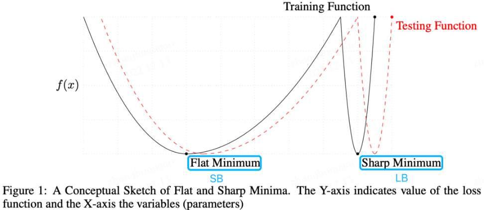
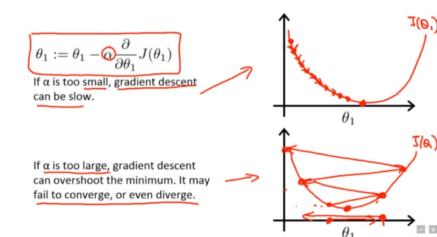

# 1. 前言

所谓超参数，即不是通过学习算法本身学习出来的，需要作者手动调整（可优化参数）的参数(理论上我们也可以设计一个嵌套的学习过程，
一个学习算法为另一个学习算法学出最优超参数)。

推荐学习资源：Google大牛调参宝典      
   github.com/google-research/tuning_playbook
   
# 2. 数据
数据驱动是当下的核心思想。

## 2.1 数据集划分及性能验证
1. 数据集划分
   通常按如下进行划分：
    - 训练集：用于学习参数的数据子集（不要和整个训练过程用到的更大的数据集搞混）
    - 验证集：用于挑选超参数的数据子集，估计训练中或训练后的泛化误差，用来更新超参数
    - 测试集：评估模型的性能，通常尽可能使用更多的不同场景的测试集，以评估模型性能

    在没有额外的测试集的情况下，把一个大集子按照7:2:1的比例进行划分。

2. 交叉验证
   由于深度学习都采用超大的数据量规模进行训练，较少使用该方法对模型进行评估

## 2.2 数据配比
在大型项目中，往往遇到一个模型需要在多个场景（比如，NLP的会议、学校、旅游不同场景）达到性能要求，
尽可能按照1：1配比，同时可能需要调节配比数量。   

## 2.3 数据筛选
数据并不是越多越好，主要源于如下几个原因：
- 数据虽多，但是相似度都太高（比如同一个说话人说的同一句话，说了好多遍），容易导致过拟合
- 现实中，往往数据标注质量没有那么高，导致错误的数据加入，反而影响性能

因此，最常用的数据筛选方法：
- 先训练一个模型，通过阈值过滤数据，把模型认为不好的数据丢掉，往复迭代，可以加速模型收敛
- 用不同场景的数据训练多个模型，多个模型联合打分筛选
- 训练一个更大的模型，性能往往更好，进行筛选（不过，注意过拟合问题）
- 通过主动学习的方法，筛选出有价值的数据，之后人工进行标注
- 其它更高级的方法，暂时不在此处讨论

## 2.4 数据训练顺序
顺序策略：
- 乱序有助于更好的学习
- 如语音或文本，按照长度排序，一是避免无效padding补0，增加训练时间，其次，避免模型学到长短差异的信息

送入到模型的训练数据一定要充分打乱（shuffle），这样在使用自适应学习率算法的时候，
可以避免某些特征集中出现，而导致的有时学习过度、有时学习不足，
使得下降方向出现偏差的问题。同时，信息论（information theor）中也曾提到: 
“从不相似的事件中学习总是比从相似事件中学习更具信息量”。

另外，为了方便做实验对比，建议设定好随机数种子! 并且，模型每轮（epoch）
训练进行前将训练数据集随机打乱（shuffle），确保模型不同轮数相同批次“看到”的数据是不同的。

## 2.5 数据增广
数据增强（图像增强）的策略必须结合具体任务来设计！数据增强的手段有多种，
常见的如下（除了前三种以外，其他的要慎重考虑）:

- 水平 / 竖直翻转
- 90°，180°，270° 旋转
- 翻转 + 旋转(旋转和翻转其实是保证了数据特征的旋转不变性能被模型学习到，卷积层面的方法可以参考论文 ACNet)
- 亮度，饱和度，对比度的随机变化
- 随机裁剪（Random Crop）
- 随机缩放（Random Resize）
- 加模糊（Blurring）
- 加高斯噪声（Gaussian Noise）


# 3. 网络层内在参数搜索

在设计网络架构的时候，我们通常需要事先指定一些网络架构参数，比如:

- 卷积层(convlution)参数: 卷积层通道数、卷积核大小、卷积步长。
- 池化层(pooling)参数: 池化核大小、步长等。
- 网络深度（这里特指卷积神经网络 cnn），即 layer 的层数；网络的深度一般决定了网络的表达（抽象）能力，网络越深学习能力越强。
- 网络宽度，即卷积层通道(channel)的数量，也是滤波器（3 维）的数量；网络宽度越宽，代表这一层网络能学习到更加丰富的特征。

这些参数一般在设计网络架构时就已经确定下来了，参数的取值一般可以参考经典 paper 和一些模型训练的经验总结，
比如有以下经验:

- 使用 3x3 卷积
- 使用 cbr 组合
- 尝试不同的权重初始化方法
- 网格搜索或者AutoML搜索

## 2.1 使用经典网络搭配
- CNN + BatchNorm + Relu
- RNN/Transformer + LayerNome


# 3. 超参搜索 

常见的搜索方法：
1. 人工搜索  
   按照论文中参数配置，或基于二分法实验
   
2. 网格搜索  
   遍历所有参数，代价较大

3. 随机搜索 
   


## 模型训练
- 权重参数初始化，常用的初始化方法有 Xavier，kaiming 系列；或者使用模型 fintune 初始化模型权重参数。

# 3. 尝试不同的权重初始化方法
尝试不同的卷积核权重初始化方式。目前常用的权重初始化方法有 Xavier 和 kaiming 系列，
pytorch 在 torch.nn.init 中提供了常用的初始化方法函数，
默认是使用 kaiming 均匀分布函数: nn.init.kaiming_uniform_()。


pytorch框架默认是使用 kaiming 均匀分布函数

下面是一个使用 kaiming_normal_（kaiming 正态分布）设置卷积层权重初始化的示例代码。
```python
import torch
import torch.nn as nn

# 定义一个卷积层
conv = nn.Conv2d(in_channels=3, out_channels=16, kernel_size=3, stride=1, padding=1)

# 使用He初始化方式设置卷积层的权重
nn.init.kaiming_normal_(conv.weight, mode="fan_out", nonlinearity="relu")
```

使用不同的卷积层权重初始化方式，会有不同的输出效果。分别使用 xavier_normal_ 和 xavier_normal_ 初始化权重，
并使一个输入图片经过一层卷积层，其输出效果是不同的，对比图如下所示:


# 4. 图片尺寸与数据增强

1，在显存满足的情况下，一般输入图片尺寸越大，模型精度越高！


# 5. batch size 设定

## 5.1 背景知识

深度学习中经常看到 epoch、 iteration 和 batchsize，这三个名字的区别如下：

- batch size：批大小。在深度学习中，一般采用 SGD 训练，即每次训练在训练集中取 batch_size 个样本训练；
- iteration：1 个 iteration 等于使用 batch_size 个样本训练一次；
- epoch：1 个 epoch 等于使用训练集中的全部样本训练一次；

## 5.2 batch size 定义

batch 一般被翻译为批量，设置 batch size 的目的让模型在训练过程中每次选择批量的数据来进行处理。
batch size 的直观理解就是一次训练所选取的样本数。

batch size 的大小会影响模型的收敛速度和优化程度。同时其也直接影响到 GPU 内存的使用情况，
如果你的 GPU 内存（显存）不大，该数值最好设置小一点，否则会出现显存溢出的错误。

## 5.3 选择合适大小的 batch size

batch size 是所有超参数中最好调的一个，也是应该最早确定下来的超参数，其设置的原则就是，batch size 别太小，
也别太大，取中间合适值为宜，通常最好是 2 的 n 次方，如 16, 32, 64, 128。
在常见的 setting（～100 epochs），batch size 一般不会低于 16。

```
设置为  2 的 n 次方的原因：计算机的 gpu 和 cpu 的 memory 
都是 2 进制方式存储的，设置 2 的 n 次方可以加快计算速度。
```

batch size 太小和太大的问题:

batch size 太小：每次计算的梯度不稳定，引起训练的震荡比较大，很难收敛。
batch size 太大: 虽然大的 batch size 可以减少训练时间，即收敛得快，但深度学习的优化（training loss 降不下去）
和泛化（generalization gap 很大）都会出问题。
（结论来源论文-Accurate, Large Minibatch SGD: Training ImageNet in 1 Hour）

有论文指出 LB（Large batch size）之所以出现 Generalization Gap 问题，
是因为 LB 训练的时候更容易收敛到 sharp minima，而 SB （Small batch size）则更容易收敛到 flat minima，
并且 LB 还不容易从这些 sharp minima 中出来，另外，作者认为关于 batch size 的选择是有一个阈值的，
一旦超过这个阈值，模型的质量会退化，网络的准确度大幅下降。


Flat_and_Sharp_Minima

```
参考论文来源 On Large-Batch Training for Deep Learning: Generalization Gap and Sharp Minima[1]，
该论文主要探究了深度学习中一个普遍存在的问题——使用大的 batchsize 
训练网络会导致网络的泛化性能下降（文中称之为Generalization Gap）。
```

另外:

合适的 batch size 范围和训练数据规模、神经网络层数、单元数都没有显著的关系。
合适的 batch size 范围主要和收敛速度、随机梯度噪音有关。

参考知乎问答-怎么选取训练神经网络时的Batch size?[2]

## 5.4 Batch size和学习率的关系
batch size 和学习率有紧密联系，随机梯度下降算法的原理如下:


n是批量大小(batchsize)， η是学习率(learning rate)。从随机梯度下降算法（SGD），
可知道除了梯度本身，这两个因子直接决定了模型的权重更新，从优化本身来看它们是影响模型性能收敛最重要的参数。

学习率（learning rate）直接影响模型的收敛状态，batch size 则影响模型的泛化性能，
两者又是分子分母的直接关系，相互也可影响。

参考来源-【AI不惑境】学习率和batchsize如何影响模型的性能？[3]

# 6. 学习率设定
## 6.1 背景知识

反向传播指的是计算神经⽹络参数梯度的⽅法。总的来说，反向传播依据微积分中的链式法则，
沿着从输出层到输⼊层的顺序，依次计算并存储⽬标函数有关神经⽹络各层的中间变量以及参数的梯度。

前向传播：输入层-->输出层；反向传播：输出层-->输入层。

现阶段的所有深度神经网络的参数都是由 BP（反向传播）算法训练得到的，
而 BP 算法是基于梯度下降（gradient desent）策略，以目标的负梯度方向对参数进行调整的，
以下公式描述了这种关系。


n是批量大小(batchsize)， η是学习率(learning rate)。w是待更新的权重参数。学习率范围为(0, 1)
控制着算法每一轮迭代中更新的步长，很明显可得，若学习率太大则容易振荡导致不收敛，
太小则收敛速度又会过慢（即损失函数的变化速度过慢）。虽然使用低学习率可以确保我们不会错过任何局部极小值，
但也意味着我们将花费更长的时间来进行收敛，特别是在被困在高原区域的情况下。


采用小学习速率（顶部）和大学习速率（底部）的梯度下降。图来源：Coursera 上吴恩达（Andrew Ng）的机器学习课程。

## 6.2 如何设置学习率
训练CNN模型，如何设置学习率有两个原则可以遵守:

- 模型训练开始时的初始学习率不宜过大，cv 类模型以 0.01 和 0.001 为宜；
- 模型训练过程中，学习率应随轮数（epochs）增加而衰减。

除以上固定规则的方式之外，还有些经验可以参考:

- 对于图像分类任务，使用 finetune 方式训练模型，训练过程中，冻结层的不需要过多改变参数，
  因此需要设置较小的学习率，更改过的分类层则需要以较大的步子去收敛，学习率往往要设置大一点。
  （来源-pytorch 动态调整学习率[4]）
- 寻找理想学习率或诊断模型训练学习率是否合适时也可借助模型训练曲线(learning curve)的帮助。
  下图展示了不同大小的学习率下损失函数的变化情况，图来自于 cs231n。
 
    
    不同学习率下训练损失值随训练轮数增加呈现的状态
  
以上是理论分析，但在实际应用中，以 pytorch 框架为例，pyTorch 提供了六种学习率调整方法，
可分为三大类，分别是:

- 有序调整：按照一定规律有序进行调整，这一类是最常用的，分别是等间隔下降(Step)， 
  按需设定下降间隔(MultiStep)，指数下降(Exponential)和 CosineAnnealing。
  这四种方法的调整时机都是人为可控的，也是训练时常用到的。
- 自适应调整: 如依据训练状况伺机调整 ReduceLROnPlateau 方法。
  该法通过监测某一指标的变化情况，当该指标不再怎么变化的时候，就是调整学习率的时机，因而属于自适应的调整。
- 自定义调整: 自定义调整 Lambda。Lambda 方法提供的调整策略十分灵活，
  我们可以为不同的层设定不同的学习率调整方法，这在 fine-tune 中十分有用，
  我们不仅可为不同的层设定不同的学习率，还可以为其设定不同的学习率调整策略，简直不能更棒了!

常见的学习率调整方法有:
- lr_scheduler.StepLR: 等间隔调整学习率。调整倍数为 gamma 倍，调整间隔为 step_size。
- lr_scheduler.MultiStepLR: 按设定的间隔调整学习率。适合后期使用，通过观察 loss 曲线，手动定制学习率调整时机。
- lr_scheduler.ExponentialLR: 按指数衰减调整学习率，调整公式:
- lr_scheduler.CosineAnnealingLR: 以余弦函数为周期，并在每个周期最大值时重新设置学习率。
- lr_scheduler.ReduceLROnPlateau: 当某指标不再变化(下降或升高)，调整学习率（非常实用的策略）。
- lr_scheduler.LambdaLR: 为不同参数组设定不同学习率调整策略。

学习率调整方法类的详细参数及类方法定义，请参考 pytorch 官方库文档-torch.optim[5]。

```
注意，PyTorch 1.1.0 之后版本，学习率调整策略的设定必须放在优化器设定的后面! 
构建一个优化器，首先需要为它指定一个待优化的参数的可迭代对象，然后设置特定于优化器的选项，
比如学习率、权重衰减策略等。
```

```
在 PyTorch 1.1.0 之前，学习率调度器应该在优化器更新之前被调用；
1.1.0 以打破 BC 的方式改变了这种行为。如果在优化器更新（调用 optimizer.step()）
之前使用学习率调度器（调用 scheduler.step()），后果是将跳过学习率调度的第一个值。
```

使用指数级衰减的学习率调整策略的模板代码如下。
 
```python
import torchvision.models as models
import torch.optim as optim
model = models.resnet50(pretrained=False)

optimizer = optim.SGD(model.parameters(), lr=0.01, momentum=0.9) # 构建优化器，lr 是初始学习率
scheduler = optim.lr_scheduler.ExponentialLR(optimizer, gamma=0.9) # 设定学习率调整策略

for epoch in range(20):
    for input, target in dataset:
        optimizer.zero_grad()
        output = model(input)
        loss = loss_fn(output, target)
        loss.backward()
        optimizer.step()
    scheduler.step()
    print_lr(is_verbose=true) # pytorch 新版本可用，1.4及以下版本不可用
```

# 参考

[0] 主要参考：深度学习炼丹-超参数设定和模型训练, https://mp.weixin.qq.com/s/upps5iZYHzRCZbEZ0wyvBg
