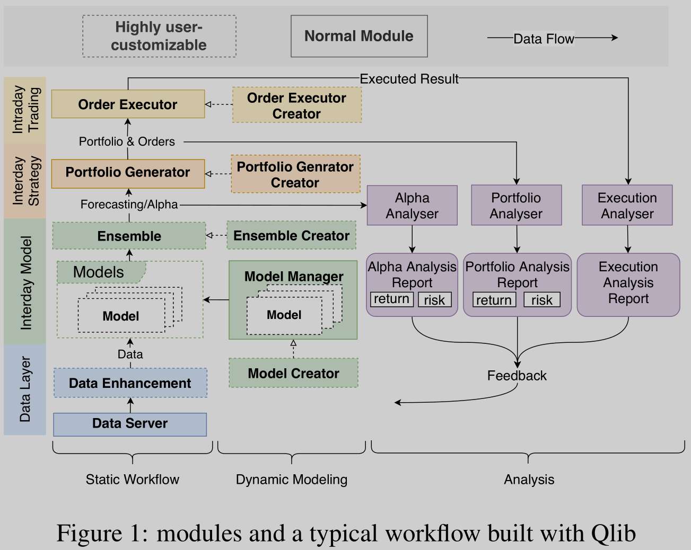

# 1. 简介

&emsp;&emsp;笔记记录与20220902.



<center>图1 qlib模块及运行流程(出自Qlib论文)[1] </center>


<center>图2 qlib运行流程(出自最新Qlib Github)[2]</center>

Infrastructure Layer: 基础结构，包括数据服务器、模型及训练管理等

* Data Server：存储管理数据，速度很快，超过各类通用数据库
* Trainer: 控制模型训练流程

Workflow Layer:整个工作流程管理层

* Information Extractor: 提取数据用于模型训练
* Forecast Model：预测模型提供各种预测信号（包括alpha、风险等）
* Decision Generator：决策

Interface：提供用户接口，报告和执行结果

# 2. 数据下载

* 通过qlib库获取数据：from qlib.tests.data import GetData
* 数据从微软官网获取：REMOTE_URL = "http://fintech.msra.cn/stock_data/downloads"
* 下载后默认存放在"~/.qlib/qlib_data/cn_data"
* 压缩包命名格式：20220701081835_qlib_data_simple_cn_1d_latest
* 之后自动解压

# 3. 辅助模块

# 4. 数据加载模块

&emsp;&emsp;数据初始化代码位置如下，调用其中的DatasetH类。

```
qlib/data/dataset/__init__.py
```

&emsp;&emsp;继承关系为DatasetH -> Dataset -> Serializable(qlib/utils/serial.py）
依次继承。

* Serializable(qlib/utils/serial.py）：基于pickle或dill库加载和保存数据
* Dataset: 未重写父类，只定义了几个函数
* DatasetH
  * 将预处理函数放在参数handler中

# 5. 数据准备

# 6. 模型训练

# 7. 策略及回测

# 8. 回测评估及报告

参考
[1] 2022.9.20, Qlib : An AI-oriented Quantitative
Investment Platform
[2] Qlib Github: https://github.com/microsoft/qlib
