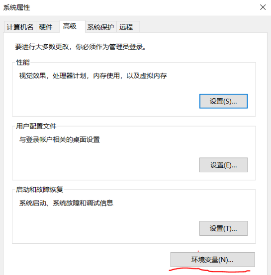

# 1.安装
## 1.1 安装要求
&emsp;&emsp;安装之前，需要安装CUDA和Cudnn，请参考"05_深度学习/01_安装/01_Win下GPU配置.md"。   
&emsp;&emsp;Git网址：https://github.com/NVIDIA/TensorRT
&emsp;&emsp;环境和版本要求如下（2022-11-12最新版本）：

TensorRT GA build
* TensorRT v8.5.1.7

System Packages
* CUDA   
    Recommended versions:
    * cuda-11.8.0 + cuDNN-8.6
    * cuda-10.2 + cuDNN-8.4
* GNU make >= v4.1
* cmake >= v3.13
* python >= v3.6.9, <= v3.10.x
* pip >= v19.0
* Essential utilities
    * git, pkg-config, wget
    
Optional Packages
* Containerized build
    * Docker >= 19.03
    * NVIDIA Container Toolkit
* Toolchains and SDKs
    * (Cross compilation for Jetson platform) NVIDIA JetPack >= 5.0 (current support only for TensorRT 8.4.0)
    * (Cross compilation for QNX platform) QNX Toolchain
* PyPI packages (for demo applications/tests)
    * onnx 1.9.0
    * onnxruntime 1.8.0
    * tensorflow-gpu >= 2.5.1
    * Pillow >= 9.0.1
    * pycuda < 2021.1
    * numpy
    * pytest
* Code formatting tools (for contributors)
    * Clang-format
    * Git-clang-format
NOTE: onnx-tensorrt, cub, and protobuf packages are downloaded along with TensorRT OSS, and not required to be installed.

## 1.2 安装
&emsp;&emsp;源码编译可能会遇到很多环境不匹配的问题，安装过程较为麻烦，可根据使用的平台，下载预编译版本。
* 预编译安装包下载：https://developer.nvidia.cn/nvidia-tensorrt-download
&emsp;&emsp;解压后，将路径添加到环境变量。

## 1.3 配置环境变量
&emsp;&emsp;桌面--》右键单击"我的电脑"图标--》选择属性--》在搜索框搜索“环境变量”--》选择“编辑系统环境变量”  
  
&emsp;&emsp;点击“环境变量”  


&emsp;&emsp;选择上图中“Path”,点击“编辑...”

&emsp;&emsp;新建环境变量，加入如下内容。
```bash
E:\Software\Win_Software\nvidia\TensorRT-8.5.1.7\include
E:\Software\Win_Software\nvidia\TensorRT-8.5.1.7\lib
```

## 1.4 python包安装
&emsp;&emsp;在1.2中的下载包下，有一个Python文件夹，安装对应版本即可。

&emsp;&emsp;下载完成后，打开下载目录，从菜单选择“打开 Windows PowerShell(R)”   
   
&emsp;&emsp;输入如下命令：
```bash
pip install .\tensorrt-8.5.1.7-cp38-none-win_amd64.whl
```
