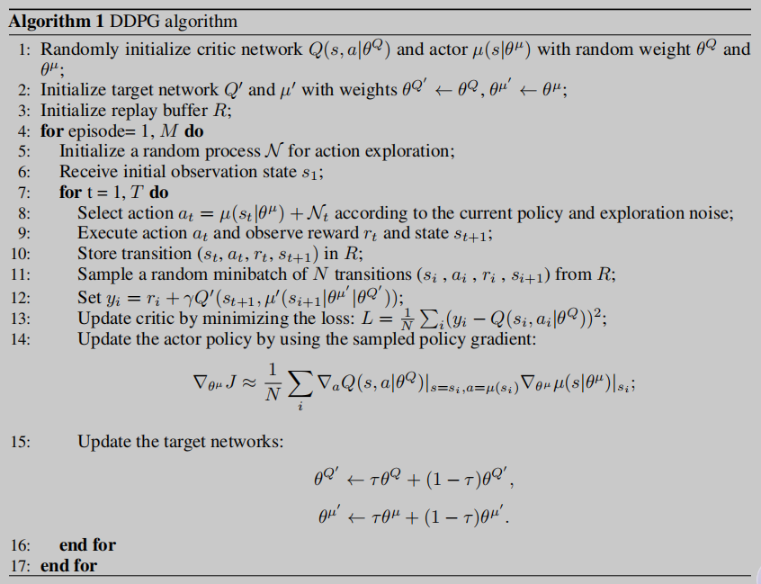
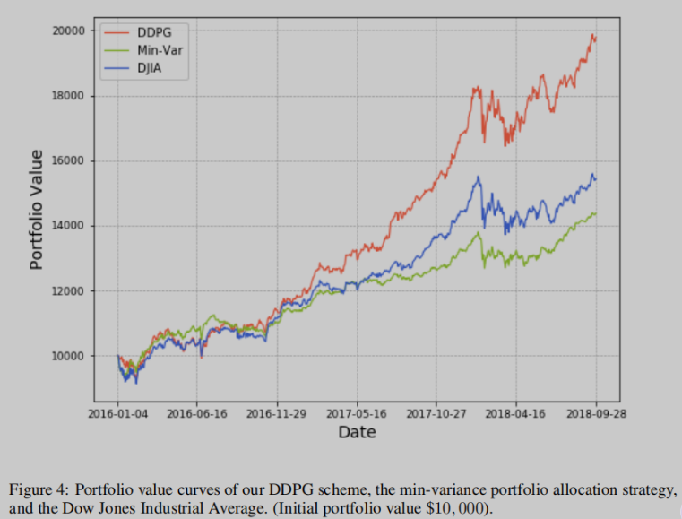

本文最后编辑日期：2023-03-01

NIPS 2018 Workshop on Challenges and Opportunities for AI in Financial Services

论文基本信息介绍：
- 论文：Practical Deep Reinforcement Learning Approach for Stock Trading
- 日期：发表与2018，最后修改与2022     
- 网址：https://arxiv.org/abs/1811.07522  
- Github来源: https://github.com/AI4Finance-Foundation/FinRL-Tutorials.git

阅读前提条件：
- 强化学习的基本知识
- 深度学习基础知识

# 1. 介绍

论文主要工作：
- 在30支股票上探索强化学习
- 和最小方差投资组合策略进行对比
- 和道琼斯工业平均指数进行比较

问题及传统方法：
1. 计算股票的收益和价格的协方差矩阵,通过在固定风险情况下最大化收益，或者在一定收益范围内，最小化风险，
   选择最佳的投资组合。缺点：投资经理如果想在每个时间点修改策略，会非常的复杂。
2. 将交易过程视为马尔可夫决策过程，并通过动态规划求解。缺点：股票状态空间很大，可扩展性差

本文方法：  
使用深度确定性策略梯度(Deep Deterministic Policy Gradient (DDPG))，包含3方面：
- actor-critic建模大的状态和动作空间
- 目标网络稳定训练过程
- 经验回放降低样本相关度，且增加数据利用率

# 2. 问题描述

## 2.1 股票交易问题定义
股票交易是一个马尔可夫决策过程Markov Decision Process (MDP)。交易的目标是一个最大化问题。

- 状态：s = [p, h, b]
    - p: 股票价格，price
    - h: 持仓股票数量，hold
    - b: 账户余额，balance
  
- 动作a: 对D支股票的动作，包括买入、卖出和持仓，即对持仓。
   动作空间代码机器人在每个状态可以执行的动作。例如，a ∈ {−1, 0, 1}, −1, 0, 1代表
   卖出、持仓、买入。当处理多支股票时，a ∈{−k, ..., −1, 0, 1, ..., k}, 比如，“买10股AAPL”或者
   “卖出10股AAPL”即10或-10。

- 奖励 r(s, a, s′): 奖励用于激励机器人学习一个更好的策略。例如，在状态s下执行动作a
  以改变投资组合值，并到达一个新的状态s', 例如，r(s, a, s′) = v′ − v, v′ 和 v 代表状态分别在s′ 
  和s时的投资组合总市值。投资组合总价值 = 所有持仓市值（p^T * h）+ 账户余额
  
- 策略π(s): 状态s时的交易策略，它本质上是状态s时a的概率分布。

- Qπ(s, a)动作价值函数：通过策略π在状态s执行动作a会得到的期望奖励

股票市场的波动描述如下。时间t, 对D支股票可进行的操作如下：

- 卖出：k (k ∈ [1, h[d]], where d = 1, ..., D)，股票可从当前持仓中卖出，k必须是整数，
       h(t+1) = h(t) - k

- 持仓: k = 0 代表h(t)不变

- 买入： 股票k可以买入，h(t+1) = h(t) + k，a(t)[d] = -k, 是负值。

需要注意所有的买入不能导致账户余额成负数。

即pt[1 : d1]^T * at[1 : d1]+bt+pt[D−d2 : D]^T * at[D−d2 : D] ≥ 0, 其中d1为买入前几支股票，
d2为要卖出的后几支股票。总资产为bt+1 = bt + pt^T * at

初始化： p0 = b0 = h = Qπ(s, a) = 0, π(s)对所有动作状态均匀分布.

按照贝尔曼公式，执行动作at, 获得期望回报r(st, at, st+1), 加上下一个状态的期望回报st+1。假设
回报有一个折扣系数

## 2.2 交易目的是最大化回报

按照马尔可夫特性，问题可以被分解为最大化策略函数 Qπ(st, at)。

# 3. 强化学习方法

DDPG是确定性梯度策略（DPG）算法的改进版。DPG集成了Q-learning和策略梯度（policy gradient）算法。
相比DPG，DDPG使用了神经网络来近似函数。

Q-learning是学习环境的一种方法。Q-leanring使用一种贪婪算法选择动作at+1来最大化状态st+1的
Q(st+1, at+1)。

通过神经网路将状态用价值函数近似表示。DQN的问题在于状态空间过大。每支股票的交易动作是一个离散集合，
随着股票数量增加，动作空间会成指数级增加，造成“维度灾难”。因此，DDPG被提出用于解决动作和状态的映射
关系。

如图2，DDPG有一个动作网络和一个评价网络。动作网络将状态映射到动作。评价网络输出在状态下动作的价值。
为了更好的探索动作，在动作网络的输出通过随机采样加入噪声。

和DQN一样，DDPG使用经验回放缓存R存储采样，同时起到减少样本相关性的作用。

Q'和µ'分别拷贝Q和µ，采用同样的参数，以提供时序差分备份。2个网络交替更新。

# 4. 性能评估

DDPG的收益明显高于道尔琼斯指数和传统的最小均方差投资组合管理方法。

## 4.1 数据预处理

- 股票池：道尔琼斯30， 1/1/2016
- 数据： 01/01/2009 - 09/30/2018
- 训练：m 01/01/2009 - 12/31/2014
- 验证（用于调参）：01/01/2015 - 01/01/2016
- 回测：01/01/2016 - 09/30/2018

为了提升性能，回测阶段，采用滑动窗持续训练学习

## 4.2 实验和结果

回测指标：总资产、年化收益、年化标准错误（反应模型的鲁棒性）、夏普率（收益和风险平衡指标，越高越好）。

# 5. 总结

本文提出DDPG深度强化学习方法，收益明显高于道尔琼斯指数和传统的最小均方差投资组合管理方法。

未来将会探索更加复杂的模型，处理大规模数据，观察性能，以及结合预测策略等。