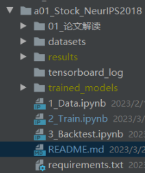

# 1. 安装所需库
    ```shell
    pip install -r requirements.txt
    ```   
    
    - 如果windows，且使用ElegantRL库，需要安装Microsoft C++ Build Tools (大约需要2.5G空间)    
      https://visualstudio.microsoft.com/visual-cpp-build-tools/   
      安装Microsoft Build Tools for Visual Studio，
      在 Build Tools 中，安装“使用C++的桌面开发”并确保安装详细信息的两项勾选：MSVC生成工具、windows SDK

# 2. 策略介绍

本策略使用道尔琼斯30支股票，通过5中深度强化学习算法进行模拟交易，

同时使用投资组合管理-最大化均值方差方法作为基线进行对比。

本策略主要使用了[finRL强化学习库](https://github.com/AI4Finance-Foundation/FinRL), 
notebook样例参考了(https://github.com/AI4Finance-Foundation/FinRL-Tutorials/tree/master/1-Introduction).

相比原始notebook，主要修改：
- 加入了大量中文的说明
- 修改了部分无法跑通的bug

# 3. 使用介绍

1. 获取数据

   - 运行 notebook: *1_Data.ipynb*. 会自动下载处理美股道尔琼斯30的OHLCV数据
   - 会生成2个文件：*train.csv*, *trade.csv* （在resources文件夹下提供）

2. 训练强化学习模型
    
    - 运行 notebook: *2_Train.ipynb*. 展示如何在OpenAI gym-style的环境中处理数据，以及训练DRL模型
    - 生成训练好的强化学习模型.zip文件

3. 回测

    - 运行notebook: *3_Backtest.ipynb*
    - 回测模型，同时对比2个基线：最大化均值方差 和 道尔琼斯指数
    - 对资产变化进行绘图

# 4. 文件说明
- 1_Data.ipynb: 从YahooDownloader下载美股数据，国内访问可能存在问题，因此可跳过此步骤，
  直接使用datasets文件夹下的数据
- 2_Train.ipynb: 模型训练，共包含5个深度强化学习算法，A2C, DDPG, PPO, TD3, SAC，
  强化学习库使用stable-baselines3
- 3_Backtest.ipynb: 基线使用最大化均值方差投资组合管理方法，和强化学习进行对比

# 5. 原理

## 5.1 原理介绍


强化学习核心部分包括“机器人”和“环境”。流程大致如下：
- 机器人和环境进行交互，观察到当前的条件，称为“状态”（**state**），并且可以执行“动作”（**action**）
- 机器人执行动作后，会进入一个新的状态，同时，环境给机器人一个反馈，叫奖励（**reward**）
  (通过数字反馈新状态的好坏)
- 之后，机器人和环境不停的重复交互，机器人要尽可能多的获取累计奖励

强化学习是一种方法，让机器人学会提升表现，并达成目标。

## 5.2 实现介绍

使用OpenAI gym的格式构建股票交易的环境。

state-action-reward的含义如下：

- **State s**: 状态空间表示机器人对环境的感知。就像人工交易员分析各种信息和数据。机器人从历史数据
  观察交易价格以及技术指标。通过和环境交互进行学习（一般通过回放历史数据）
  
- **Action a**: 动作空间代码机器人在每个状态可以执行的动作。例如，a ∈ {−1, 0, 1}, −1, 0, 1代表
  卖出、持仓、买入。当处理多支股票时，a ∈{−k, ..., −1, 0, 1, ..., k}, 比如，“买10股AAPL”或者
  “卖出10股AAPL”即10或-10。

- **Reward function r(s, a, s′)**: 奖励用于激励机器人学习一个更好的策略。例如，在状态s下执行动作a
  以改变投资组合值，并到达一个新的状态s', 例如，r(s, a, s′) = v′ − v, v′ 和 v 代表状态分别在s′ 
  和s时的投资组合总市值。
  
- **Market environment**: 道琼斯工业平均指数（DJIA）中30只成分股，包含回测时间段的所有交易数据。

代码中使用了波动率的指标，当波动率大于阈值时，空仓以规避风险。

主要依赖的代码：
- 环境：finrl/meta/env_stock_trading/env_stocktrading.py
- 模型：finrl/agents/stablebaselines3/models.py

# 6. 模型目录结构


回测结果：
```
a2c:
Annual return          0.531267
Cumulative returns     0.761977
Annual volatility      0.207082
Sharpe ratio           2.168219
Calmar ratio           5.108832
Stability              0.913644
Max drawdown          -0.103990
Omega ratio            1.434179
Sortino ratio          3.603966
Skew                        NaN
Kurtosis                    NaN
Tail ratio             1.140148
Daily value at risk   -0.024308

 sac:
Annual return          0.229471
Cumulative returns     0.316038
Annual volatility      0.135545
Sharpe ratio           1.597028
Calmar ratio           2.503250
Stability              0.885632
Max drawdown          -0.091669
Omega ratio            1.300750
Sortino ratio          2.291562
Skew                        NaN
Kurtosis                    NaN
Tail ratio             1.029162
Daily value at risk   -0.016218
```

# 7. 实验结果
时间结果分别是深度强化学习策略A2C和SAC，以及基线最大化均值方差。

初始化资金为1000000，可以看到3个策略均实现很高的收益。


# 8. 潜在问题及不足

1. 训练和测试不一致：测试中引入了波动率及阈值（该问题正在确认中）
2. （***）该策略的状态信息用到了收盘价/最高价/最低价，可能看到了未来（该问题正在确认中）
3. 模拟环境中没有考虑滑点值
4. 模拟环境没有考虑股票停牌的信息

# 8. 常见问题
## 8.1. 无法复现论文结果
参考：https://github.com/AI4Finance-Foundation/FinRL-Tutorials/issues/43  

- 问题：论文中的结果无法复现，自己训得比网站给的预训练模型性能差很多  
- 原因：由于强化学习不稳定，建议调参，或者多训练几遍

## 8.2. 'numpy.float64' object has no attribute 'values'
读取训练数据，所有股票均混在了一个csv表里，格式如下
```
索引     日期          股票
 0      2009-01-02    苹果
 0      2009-01-02    亚马逊
 1      2009-01-05    苹果
 1      2009-01-05    亚马逊
```

注意：必须保持上述该格式，同样的索引下至少有2个数据，否则会报错，
原因：
  1. 在finrl/meta/env_stock_trading/env_stocktrading.py的
     _initiate_state函数中self.data.close.values.tolist()，
     在404行，要求self.data.close必须是二维数组
  2. 而finrl/meta/env_stock_trading/env_stocktrading.py的
     __init__的64行self.data = self.df.loc[self.day, :]，
     如果索引顺序排，0，1，2。。。，会导致只取到一个行数，一维
     数据传入导致第1点中所述的问题
     （因此，如果只有一支股票时，需要把索引全部改成一样的，当然
     这种情况几乎不存在，也可以暂时忽略）
     
解决方法：
1. 降低numpy版本
2. 把数据改成二维的，即（10，）-》（1，10） （改完是否存在回测不完整性，没有详细验证）
3. 保持最上方所示的数据格式（推荐）

## 8.3. "zipline.assets" not found

问题：  
    anaconda3\lib\site-packages\pyfolio\pos.py:26: UserWarning: Module "zipline.assets" not found; 
    mutltipliers will not be applied to position notionals.
      warnings.warn(
      
原因：
- pyfolio报出的错误，Quantopian's Zipline只支持3.7以下版本，不过zipline不是强制安装，可忽略。
- 参考1：https://github.com/quantopian/pyfolio/issues/654
- 参考2：https://github.com/AI4Finance-Foundation/FinRL/issues/313